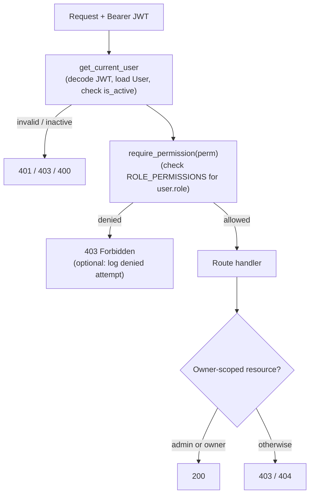

# Fullstack-Dev-Test-Task

This is a task to test potential candidate skills in Python + SQL + TypeScript.

- **Assignment**: Add Role-Aware Access + Architecture Decisions + **Run the app**
- **Timebox**: Aim for up to 1 hour. If you cut scope, say what you cut and why.


## Table of Contents

- [Goal](#goal)
- [Base Template](#base-template)
- [Suggested Time Allocation](#suggested-time-allocation)
- [Requirements](#requirements)
  - [1. Clone the Base Template](#1-clone-the-base-template)
  - [2. Roles and Authorization Surface](#2-roles-and-authorization-surface)
  - [3. Code Quality Expectations](#3-code-quality-expectations)
  - [4. Architecture & Documentation](#4-architecture--documentation)
  - [5. Non-Functional Requirements](#5-non-functional-requirements)
  - [6. UX Behavior](#6-ux-behavior)
  - [7. Developer UX](#7-developer-ux)
- [Constraints](#constraints)
- [What We Review](#what-we-review)
- [Submission](#submission)

## Goal

Add role-based access control (RBAC) to the existing Full-Stack FastAPI Template so that only authorized users can access sensitive endpoints and UI sections.

**We prioritize clean, maintainable code over comprehensive test coverage or extensive documentation.**

You may reuse any libraries already in the template.

> **Note**: RBAC can be implemented with simple role checks or a small policy layer. Keep scope tight. Favor clarity over cleverness.

## Base Template

**Tech Stack**:
- **Backend**: FastAPI / SQLModel / PostgreSQL
- **Frontend**: React / TypeScript

**Repository**: [full-stack-fastapi-template](https://github.com/fastapi/full-stack-fastapi-template/tree/master)

## Suggested Time Allocation

How we believe it is doable in a 1-hour timebox:

| Activity | Time           | Priority |
|----------|----------------|----------|
| Understanding the codebase | 15 min         | High |
| Implementation (clear, maintainable code) | 25 mins | **Critical** |
| Testing (focused, critical paths) | 10 min         | High |
| Documentation (README updates) | 10 min         | Medium |

**If running short on time:**
- ✓ **Prioritize**: Clear, working authorization code with consistent patterns
- ✓ **Then**: 3-5 well-chosen tests covering critical scenarios
- ⚠ **Cut if needed**: Extra features, comprehensive test coverage, diagrams
- ❌ **Don't cut**: Security checks, README setup instructions

## Requirements

### 1. Clone the Base Template

Clone the repository: https://github.com/fastapi/full-stack-fastapi-template/tree/master

### 2. Roles and Authorization Surface

#### Implement the Following Roles

| Role | Permissions |
|------|-------------|
| **admin** | Full access to user management and settings |
| **manager** | Can list users and view metrics, but not change global settings |
| **member** | Can only access their own profile and basic app features |

#### Protect a Small but Realistic Surface

- List users
- Create user
- View "metrics/insights" page (simple stub is acceptable)
- View and update own profile

**Exact permission mapping is up to you.**

State it clearly in your docs and enforce it consistently in the backend and frontend.

#### Example Permission Matrix (Document Something Similar)

| Action | admin | manager | member |
|--------|-------|---------|--------|
| List all users | ✓ | ✓ | ✗ |
| Create user | ✓ | ✗ | ✗ |
| View metrics | ✓ | ✓ | ✗ |
| Update own profile | ✓ | ✓ | ✓ |
| Update any profile | ✓ | ✗ | ✗ |

### 3. Code Quality Expectations

**We prioritize maintainable, readable code over clever solutions.**
 
- **Clear naming**: Function/variable names that explain intent without comments
- **Single responsibility**: Small, focused functions
- **Easy to extend**: Adding a new role shouldn't require touching 10+ files
- **Self-documenting**: Code structure makes the authorization model obvious

> **Key principle**: A teammate should understand your authorization model in 5 minutes by reading your code.

### 4. Architecture & Documentation

Document your implementation approach clearly but concisely.

#### Required

- [ ] **Permission matrix** in README showing which role can access what
- [ ] **Brief explanation** (2-4 paragraphs) of your authorization approach:
  - Where authorization checks live (middleware, dependencies, decorators?)
  - How roles are stored and validated
  - How frontend learns about user capabilities
- [ ] **Inline code comments** only for non-obvious authorization logic

#### Optional (Bonus Points)

- [ ] **1-2 Architecture Decision Records (ADRs)** for your most critical decisions
  - Use any simple ADR format (problem, options, decision, trade-offs)
  - 200-400 words each
  - Example topics: Why you chose your authorization pattern, where checks live, how the frontend handles permissions
- [ ] **Simple diagram** showing where auth/authz checks happen
  - Mermaid, C4-style, or hand-drawn PNG is fine

**Philosophy**: We value clear thinking over formal documentation. 
Your code should clearly explain your approach; that's usually sufficient.
RBAC implementation, though, usually has at least a few options to implement, hence an additional README will add value.

### 5. Non-Functional Requirements

Demonstrate you considered real-world constraints:

#### 1. Maintainability (Critical)

- Keep coupling low; use consistent patterns
- A teammate should understand your authorization logic in 5 minutes

#### 2. Testability (Important)

- Provide **focused backend tests** covering critical authorization paths

> **Note**: Tests are required, but we prioritize **quality over quantity**. 3 well-chosen tests with clean code beat 20 tests with spaghetti code.

### 3. UX Behavior

- **The UI** should:
  - Hide navigation links/buttons that the user can't access
  - Show a friendly "Forbidden" or "Access Denied" message if navigating directly to unauthorized routes
  - Not just fail silently or show cryptic errors

### 4. Developer UX

Update the README with:

- **How to run locally** (setup, dependencies, database)
- **How to seed test data** with at least one admin and one non-admin user
- **How to run tests**
- **Database migrations** for any schema changes (if applicable)

Make it easy for us to run your solution without hunting for setup instructions.

## What We Review

### Primary Criteria (60%)

**Code readability and maintainability**
- ✓ Clear separation of concerns
- ✓ Consistent authorization patterns
- ✓ Self-documenting code structure
- ✓ Low coupling between components
- ✓ Easy to understand and extend

**Working RBAC implementation**
- ✓ Consistent enforcement in backend and frontend
- ✓ No obvious security gaps or privilege escalation
- ✓ Correct HTTP status codes and error handling

### Secondary Criteria (30%)

**Test coverage**
- ✓ Focused tests on critical authorization paths
- ✓ Both allowed and denied scenarios tested
- ✓ Tests are clear and well-named

**Setup and documentation**
- ✓ Setup instructions work on first try
- ✓ Clear explanation of authorization approach
- ✓ Permission matrix documented

### Nice to Have (10%)

- Thoughtful UX for forbidden states
- Observability (logging denied attempts)
- Architecture Decision Records (ADRs)
- Helpful diagrams
- Extra polish

> **Philosophy**: We're evaluating your ability to write production-quality code under time constraints. We'd rather hire someone who delivers clean, working code with good tests than someone who delivers everything but it's hard to maintain.

## Submission

**Deliverables**:

- [ ] PR or repo link with commit history
- [ ] Updated README with:
  - Setup instructions
  - Permission matrix
  - Brief explanation of your approach
- [ ] Backend tests covering critical authorization scenarios
- [ ] Working implementation of RBAC
- [ ] Optional: `NOTES.md` with anything you want us to know (scope cuts, trade-offs, what you'd do with more time)

---

**Good luck!** Focus on demonstrating clear thinking and solid engineering fundamentals. We're looking for maintainable code, not perfect code.

---

## Authorization (RBAC)

### Permission Matrix

| Action | admin | manager | member |
|--------|:-----:|:-------:|:------:|
| List all users | yes | yes | no |
| Create user | yes | no | no |
| View metrics / insights | yes | yes | no |
| Read / update own profile | yes | yes | yes |
| Read / update / delete any user | yes | no | no |
| Change global settings | yes | no | no |
| Manage own items | yes | yes | yes |
| Manage any item | yes | no | no |

### Approach

Authorization checks live in FastAPI dependencies, not middleware or scattered conditionals. A single policy module (`src/backend/app/core/permissions.py`) defines a `Permission` enum and a `ROLE_PERMISSIONS` matrix mapping each `Role` to the permissions it grants. A `require_permission` dependency factory (`src/backend/app/api/deps.py`) reads the current user's role and returns 403 if the required permission is missing. Routes declare the permission they need, so each endpoint is self-documenting.

Roles are stored as a single `role` string column on the `User` table, validated by a `Role` enum. This replaces the template's binary `is_superuser` flag, which is preserved only as a derived value (`role == admin`) for backward compatibility. Roles are read from the database on each request as part of loading the authenticated user; they are not encoded in the JWT, so a role change takes effect immediately.

The frontend learns about capabilities from `GET /users/me`, which returns the user's `role`. A small mirror of the permission matrix (`src/new-frontend/src/lib/permissions.ts`) drives UX only: it hides navigation and actions the user cannot use and renders a Forbidden page on direct navigation to an unauthorized route. The backend remains the sole enforcement boundary; the frontend never grants access the API would deny.

Extensibility: adding a role or permission is a code-only change to the enums and the two matrices (backend + frontend mirror). No database DDL is required because `role` is stored as a string.

### Architecture



### Run Locally

Requires a running PostgreSQL instance. Create a `.env` file in `src/backend/` with the variables listed in the next section.

```bash
# Backend
cd src/backend
poetry install
poetry run alembic upgrade head
poetry run python app/initial_data.py   # seeds FIRST_SUPERUSER (+ optional manager/member)
poetry run uvicorn app.main:app --reload --host 0.0.0.0 --port 8000
# API docs: http://localhost:8000/docs

# Frontend (separate terminal)
cd src/new-frontend
npm install
npm run dev
# http://localhost:5173
```

### Seed Test Data

Set the following keys in `src/backend/.env` and re-run `poetry run python app/initial_data.py`:

```dotenv
FIRST_SUPERUSER=admin@example.com
FIRST_SUPERUSER_PASSWORD=changethis
FIRST_MANAGER=manager@example.com
FIRST_MANAGER_PASSWORD=changethis
FIRST_MEMBER=member@example.com
FIRST_MEMBER_PASSWORD=changethis
```

Alternatively, log in as admin and assign roles directly through the Admin UI.

### Run Tests

```bash
cd src/backend

# Full suite (requires a reachable PostgreSQL DB configured in .env)
bash scripts/test.sh

# RBAC authorization tests only
poetry run pytest app/tests/api/api_v1/test_rbac.py -v
```

### Database Migrations

The RBAC change ships an Alembic migration (`a5b6c7d8e9f0_add_role_to_user.py`) located in `src/backend/app/alembic/versions/`. It adds the `role` column and backfills `admin` for all existing superusers. Revision chain: `e2412789c190 → a5b6c7d8e9f0`.

The migration runs automatically via `src/backend/prestart.sh` (`alembic upgrade head`) or manually:

```bash
cd src/backend && poetry run alembic upgrade head
```
