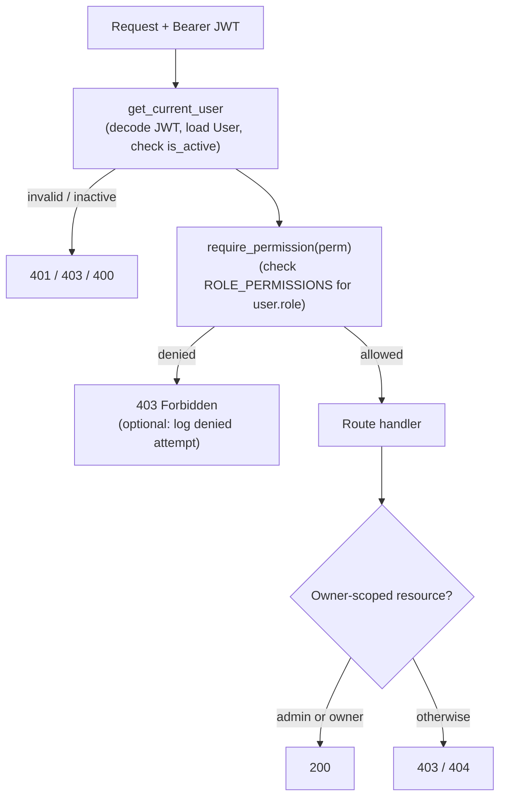

# Full-Stack FastAPI Template with RBAC

Built on the [FastAPI full-stack template](https://github.com/fastapi/full-stack-fastapi-template), this project extends the base with a three-role RBAC system (admin / manager / member). Authorization checks live in FastAPI dependencies backed by a centralized permission matrix, replacing the template's binary `is_superuser` flag. The frontend mirrors the same matrix to hide inaccessible UI and render a Forbidden page on direct navigation to unauthorized routes.

## Tech Stack

- **Backend**: FastAPI / SQLModel / PostgreSQL
- **Frontend**: React / TypeScript

## Authorization (RBAC)

### Permission Matrix

| Action | admin | manager | member |
|--------|:-----:|:-------:|:------:|
| List all users | yes | yes | no |
| Create user | yes | no | no |
| View metrics / insights | yes | yes | no |
| Read / update own profile | yes | yes | yes |
| Read / update / delete any user | yes | no | no |
| Change global settings | yes | no | no |
| Manage own items | yes | yes | yes |
| Manage any item | yes | no | no |

### Approach

Authorization checks live in FastAPI dependencies, not middleware or scattered conditionals. A single policy module (`src/backend/app/core/permissions.py`) defines a `Permission` enum and a `ROLE_PERMISSIONS` matrix mapping each `Role` to the permissions it grants. A `require_permission` dependency factory (`src/backend/app/api/deps.py`) reads the current user's role and returns 403 if the required permission is missing. Routes declare the permission they need, so each endpoint is self-documenting.

Roles are stored as a single `role` string column on the `User` table, validated by a `Role` enum. This replaces the template's binary `is_superuser` flag, which is preserved only as a derived value (`role == admin`) for backward compatibility. Roles are read from the database on each request as part of loading the authenticated user; they are not encoded in the JWT, so a role change takes effect immediately.

The frontend learns about capabilities from `GET /users/me`, which returns the user's `role`. A small mirror of the permission matrix (`src/new-frontend/src/lib/permissions.ts`) drives UX only: it hides navigation and actions the user cannot use and renders a Forbidden page on direct navigation to an unauthorized route. The backend remains the sole enforcement boundary; the frontend never grants access the API would deny.

Extensibility: adding a role or permission is a code-only change to the enums and the two matrices (backend + frontend mirror). No database DDL is required because `role` is stored as a string.

### Architecture



## Running the project

### Run Locally

Requires a running PostgreSQL instance. Create a `.env` file in `src/backend/` with the variables listed in the next section.

```bash
# Backend
cd src/backend
poetry install
poetry run alembic upgrade head
poetry run python app/initial_data.py   # seeds FIRST_SUPERUSER (+ optional manager/member)
poetry run uvicorn app.main:app --reload --host 0.0.0.0 --port 8000
# API docs: http://localhost:8000/docs

# Frontend (separate terminal)
cd src/new-frontend
npm install
npm run dev
# http://localhost:5173
```

### Seed Test Data

Set the following keys in `src/backend/.env` and re-run `poetry run python app/initial_data.py`:

```dotenv
FIRST_SUPERUSER=admin@example.com
FIRST_SUPERUSER_PASSWORD=changethis
FIRST_MANAGER=manager@example.com
FIRST_MANAGER_PASSWORD=changethis
FIRST_MEMBER=member@example.com
FIRST_MEMBER_PASSWORD=changethis
```

Alternatively, log in as admin and assign roles directly through the Admin UI.

### Run Tests

```bash
cd src/backend

# Full suite (requires a reachable PostgreSQL DB configured in .env)
bash scripts/test.sh

# RBAC authorization tests only
poetry run pytest app/tests/api/api_v1/test_rbac.py -v
```

### Database Migrations

The RBAC change ships an Alembic migration (`a5b6c7d8e9f0_add_role_to_user.py`) located in `src/backend/app/alembic/versions/`. It adds the `role` column and backfills `admin` for all existing superusers. Revision chain: `e2412789c190 → a5b6c7d8e9f0`.

The migration runs automatically via `src/backend/prestart.sh` (`alembic upgrade head`) or manually:

```bash
cd src/backend && poetry run alembic upgrade head
```
