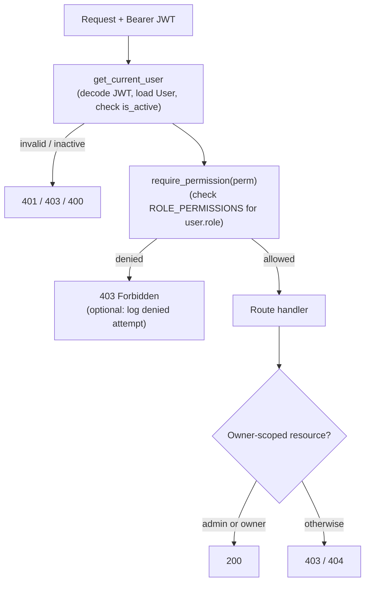

# Phase 0 - Overview & Permission Model

This document is the index for the RBAC (Role-Based Access Control) implementation plan for the
Full-Stack FastAPI Template. It defines the role model, the permission matrix, the core
architecture decisions, and the scope. Each subsequent phase document lists the concrete,
ordered operations for one slice of the work.

## Goal

Add role-based access control with three roles - `admin`, `manager`, `member` - so that only
authorized users can reach sensitive endpoints (backend) and UI sections (frontend). The model
replaces the template's binary `is_superuser` flag with a single `role` field that is the source
of truth, while keeping `is_superuser` available as a backward-compatible derived value.

## Roles

| Role | Intent |
|------|--------|
| `admin` | Full access to user management and global settings. Maps 1:1 to the old `is_superuser=True`. |
| `manager` | Can list users and view metrics/insights, but cannot create/modify users or change global settings. |
| `member` | Default role. Can access only their own profile and basic app features (items). |

## Permission Matrix (source of truth for the whole implementation)

| Action | admin | manager | member |
|--------|:-----:|:-------:|:------:|
| List all users | yes | yes | no |
| Create user | yes | no | no |
| View metrics / insights | yes | yes | no |
| Read own profile | yes | yes | yes |
| Update own profile | yes | yes | yes |
| Read any user by id | yes | no | no |
| Update any user | yes | no | no |
| Delete any user | yes | no | no |
| Change global settings (test-email, admin utils) | yes | no | no |
| Manage own items | yes | yes | yes |
| Manage any item | yes | no | no |

This matrix is implemented once on the backend (`ROLE_PERMISSIONS` in
`backend/app/core/permissions.py`) and mirrored once on the frontend
(`frontend/src/lib/permissions.ts`). Those two files plus the `Role`/`Permission` enums are the
only places that change when adding a role or permission.

## Core Architecture Decisions

1. **Single source of truth: a `role` enum on `User`.**
   We add `role: Role` to the `User` model and remove the `is_superuser` column. A migration
   backfills `role = admin` for every existing `is_superuser = True` user. `is_superuser` is kept
   only as a read-only derived value (`role == Role.admin`) so existing internal checks and
   external clients do not break during the transition.

2. **Roles stored as a string column, validated by an enum.**
   The `role` column is a plain `VARCHAR`, not a native Postgres enum type. This keeps the
   migration simple and means adding a new role never requires an `ALTER TYPE` DDL change - it is
   a code-only change. Validation happens at the application boundary via the `Role` enum.

3. **Authorization lives in FastAPI dependencies, not middleware or scattered `if` checks.**
   A single `require_permission(...)` dependency factory in `backend/app/api/deps.py` enforces the
   matrix. Routes declare the permission they need. This replaces both
   `get_current_active_superuser` and the inline `if current_user.is_superuser` checks in
   `items.py` / `users.py`.

4. **Roles are read from the DB on each request (no roles in the JWT).**
   The JWT continues to carry only the user id (`sub`). The role is loaded with the user in
   `get_current_user`. This matches the template's existing behavior and means a role change takes
   effect immediately without re-issuing tokens.

5. **The frontend mirrors, never invents, permissions.**
   The frontend derives `role` from `GET /users/me` and uses a mirror of the matrix purely for UX
   (hiding nav, showing a Forbidden page). The backend remains the only enforcement boundary.

## Current vs Target

The template today (researched in `backend/app/api/deps.py`, `backend/app/models.py`,
`backend/app/api/routes/users.py`, `backend/app/api/routes/items.py`) has only two effective
tiers: a normal active user and a superuser. Authorization is split between the
`get_current_active_superuser` dependency and inline `current_user.is_superuser` checks.

## Phase Index

| Phase | Document | Scope |
|-------|----------|-------|
| 1 | `phase-1-backend-data-model.md` | `Role` enum, model/schema changes, Alembic migration, seeding |
| 2 | `phase-2-backend-authorization.md` | `permissions.py`, `require_permission` dependency, route protection, metrics stub |
| 3 | `phase-3-backend-tests.md` | manager/member fixtures, allowed/denied tests, escalation guard |
| 4 | `phase-4-frontend-rbac.md` | client regen, permissions module, nav/guards, Forbidden page, 403 handling, role selector, metrics page |
| 5 | `phase-5-docs-run-submission.md` | README matrix + approach, run/seed/test instructions, ADRs, NOTES.md, review checklist |

## Scope & Cuts

In scope:
- `admin` / `manager` / `member` roles enforced consistently on backend and frontend.
- The realistic surface from the task: list users, create user, metrics/insights page, view &
  update own profile, plus update/delete any user and the existing items surface.
- Focused backend tests for allowed and denied paths.
- README permission matrix + approach, run/seed/test instructions.

Out of scope (stated deliberately):
- No separate roles/permissions database table. A string-backed enum is sufficient and clearer for
  three fixed roles.
- No per-object ACLs beyond the existing owner-or-admin item checks.
- No org/tenant scoping, no role hierarchies beyond the flat matrix.
- Roles are not encoded in the JWT (read from DB per request, as the template already does for the
  user record).
